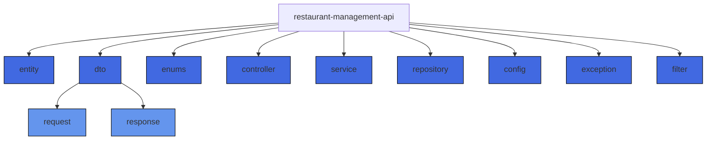
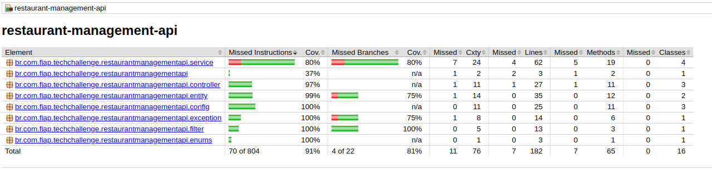

# Tech Challenge Pós FIAP 7ADJT

## Restaurant Management API

### Arquitetura da Aplicação 

```
src/main/java/fiap/techchallenge/restaurant-management-api/
├── entity/              # Classes representando tabelas do db
├── dto/                 # Objetos de Transferência de Dados (DTO)
│   ├── request/         # DTOs para dados de entrada (requests)
│   └── response/        # DTOs para dados de saída (responses)
├── enums/               # Definições de tipos enumerados
├── controller/          # Endpoints REST
├── service/             # Lógica de negócios
├── repository/          # Interfaces JPA para persistência
├── config/              # Configurações do projeto
├── exception/           # Classes para tratamento de exceções
├── filter/              # Classes para execução de filtros nas requisições

```



### Rodando a aplicação

#### Rodando o Docker para construção dos containers
```bash
docker-compose build
```

#### Rodando a aplicação com docker
```bash
$ docker-compose up
```

#### Rodando em paralelo
```bash
$ docker-compose up -d
```

#### Acessando o container
```bash
$ docker exec -it restaurant-management-api sh
```

#### Executando os testes
```bash
$ docker exec -it restaurant-management-api ./mvnw test -Dspring.profiles.active=test
```
### Configurando o banco de dados

A aplicação utiliza o banco de dados PostgreSQL, o usuário e a senha padrão são `postgres` e `postgres`, respectivamente.
A criação do banco de dados é feita automaticamente pela aplicação.

Para criar um usuário ADMIN execute esse script SQL:

```sql
INSERT INTO users (
    name,
    email,
    username,
    password,
    created_at,
    updated_at,
    type,
    street,
    neighborhood,
    zip_code,
    city,
    state,
    number,
    complement
) VALUES (
             'Admin',
             'admin@admin.com',
             'admin',
             '$2a$10$w1dWOuy7TEVb4vBQRCne5eXibqaOVO82CRLwwCZ1i0BevQSOsIr4e',
             NOW(), -- created_at
             NOW(), -- updated_at
             'OWNER',
             'Rua Exemplo',
             'Bairro Central',
             '12345-678',
             'Cidade Exemplo',
             'EX',
             '100',
             'Sala 01'
         );
```
A senha do usuário admin é `admin123`.

### Usando Postman

É possível importar uma collection do Postman usando o arquivo `RestaurantManagementApi-7ADJT.postman_collection.json`
que está na raiz do projeto.

#### Autenticação

O processo de autenticação funciona por meio de um `JWT Token`.

Para gerar um Token acesse a rota `/login` passando um JSON com o `username` e `password` do usuário.

```json
{
    "username": "admin",
    "password": "admin123"
}
```
O token gerado deve ser passado no header `Authorization` de todas as requisições.

##### Passo a passo

- Navegue no Postman até a aba `Authorization;
- Selecione o tipo `Berear Token`;
- E passe o JWT Token gerado no endpoint `/api/auth/login` para realizar as requisições.;
- Você pode usar Environment Variables para facilitar a troca de credenciais;

#### Endpoints


| **Endpoint**          | **Método** | **Descrição**                                                                      | Precisa de Autentição | **Exemplo de Requisição**                                                                                                                                                              |
| --------------------- | ---------- | ---------------------------------------------------------------------------------- |-----------------------| -------------------------------------------------------------------------------------------------------------------------------------------------------------------------------------- |
| `/users`              | POST       | Cria um novo usuário no sistema.                                                   | Sim                   | **URL**: `http://localhost:8080/users`  <br> **Body**: `{ "name": "John Doe", "email": "john.doe@example.com", "type": "CUSTOMER", "username": "johndoe", "password": "password123" }` |
| `/users/{id}`         | GET        | Obtém os detalhes de um usuário pelo ID.                                           | Sim                   | **URL**: `http://localhost:8080/users/1`                                                                                                                                               |
| `/users`              | GET        | Lista todos os usuários com suporte a paginação.                                   | Sim                   | **URL**: `http://localhost:8080/users?page=0&size=10`                                                                                                                                  |
| `/users/{id}`         | PUT        | Atualiza os dados de um usuário existente.                                         | Sim                   | **URL**: `http://localhost:8080/users/1`  <br> **Body**: `{ "name": "John Updated", "email": "john.updated@example.com", "type": "OWNER", "username": "johnupdated" }`                 |
| `/users/{id}`         | DELETE     | Remove um usuário pelo ID.                                                         | Sim                   | **URL**: `http://localhost:8080/users/1`                                                                                                                                               |
| `/users/{id}/password` | PATCH      | Atualiza a senha de um usuário existente.                                          | Sim                   | **URL**: `http://localhost:8080/users/1/password`  <br> **Body**: `{ "oldPassword": "oldpassword123", "newPassword": "newpassword456" }`                                               |
| `/login`      | POST       | Realiza o login de um usuário no sistema, retornando dados de autenticação.        | Não                   | **URL**: `http://localhost:8080/api/auth/login`  <br> **Body**: `{ "username": "johndoe", "password": "password123" }`                                                                 |
| `/health`             | GET        | Verifica a saúde da aplicação, retornando uma mensagem de status de funcionamento. | Sim                   | **URL**: `http://localhost:8080/health`                                                                                                                                                |

### Verificando a Cobertura de testes

Foi adicionado ao projeto a biblioteca Jacoco para verificar a cobertura de testes.
Para usar após rodar os testes verifique o relatório chamado no diretório `target/site/jacoco/index.html`.



](https://www.jacoco.org/images/jacoco.png)


